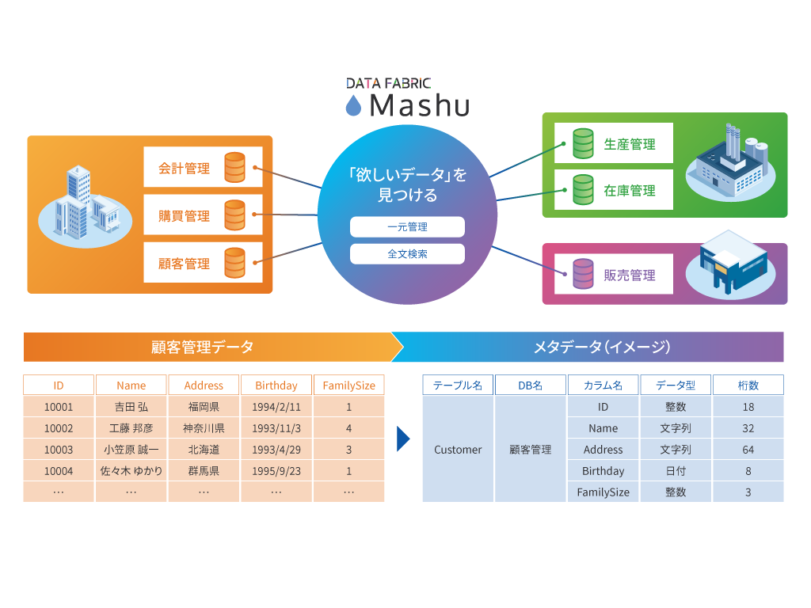
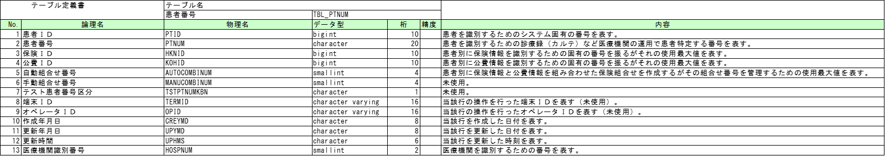

---

marp: true
paginate: true
size: 16:9
header: Japan DX Week 2024 秋
footer: ROBON Inc. Data Fabric Dept.
# theme: gaia
# theme: uncover

---

# 05 テーブル仕様書をインポート&エクスポートしよう

---

---

## ORCAとは
- [日本医師会ORCA管理機構](https://www.orca.med.or.jp/) が開発、公開している「医事会計サービス」です。

- ソースコード、基本設計書などが公開されています。
  - ソースコードの中から、PostgreSQL のテーブル作成を行う SQL をお借りして、デモ用のデータベースを作りました。
  - 基本設計書の中から、テーブル仕様書をお借りして、PDF から EXCEL 書式に変換したものを用います。

---

## テーブル仕様書.xlsx

- 論理名、日本語名は大事。
- Unicode というか UTF-8 のおかげで、文字コード地獄は減りましたが、物理名は英数字にしておくのが吉。
- EXCEL のテーブル仕様書の情報を Mashu に取り込むことで、最新のデータベースに論理名と説明を付与して、Mashu というシステムを通して、全ての関係者で共有しよう！

---

<pre class="mermaid" style="text-align: center">
---
title: デモ環境
config:
   look: handDrawn
   theme: neutral
   themeCSS: ".label{font-weight: bold;}"
---
graph LR
    Browser -- HTTP / Web API:3000 --> Agent
    Agent -- Reverse Proxy --> Mashu

    subgraph Docker["docker-compose
        (05_robonet)"]
        Agent -- 独自プロトコル:5432 --> DB
    end
    subgraph OnPre["オンプレミス(このPC)"]
        Browser
        Docker
    end
    
    Browser[Chrome
            ブラウザ]
    Agent["Mashu サーバ
            (mashu)"]
    DB[("PostgreSQL
            データベース
            (postres)")] 

    Mashu[Mashu SaaS
            on クラウド]
</pre>

---

## Demo
- [Mashu](http://localhost/) は、データソース単位で、テーブル情報のエクスポートとインポートが可能です。
- Mashu からエクスポートした [CSV](ORCA_utf8.csv) に、EXCEL のテーブル仕様書の情報を転記した [CSV](ORCA_output.csv) を、インポートします。
