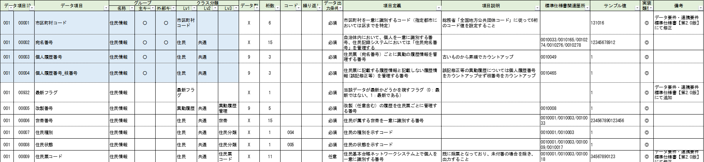

---

marp: true
paginate: true
size: 16:9
header: Japan DX Week 2024 秋
footer: ROBON Inc. Data Fabric Dept.
# theme: gaia
# theme: uncover

---

# 06 カスタムタグを作成してインポートしよう

---

---

## 地方自治体の基幹業務システムの統一・標準化とは
- [デジタル庁](https://www.digital.go.jp/policies/local_governments) が推進しているガバメントクラウド上に地方自治体の基幹システムを整備する計画です。

- [データ要件・連携要件の標準仕様](https://www.digital.go.jp/policies/local_governments/specification)が公開されています。
  - 仕様書からデータベースのテーブルを作成したものを用意しました。

---

## 001_住民基本台帳_基本データリスト【第2.1版】_20230929.xlsx

- 論理名や説明以外の情報もしっかりと管理している場合、Mashu でもその情報を活用しましょう。
- EXCEL のテーブル仕様書の情報を Mashu に拡張タグとして取り込むことで、Mashu というシステムを通して、全ての関係者で共有しよう！

---

<pre class="mermaid" style="text-align: center">
---
title: デモ環境
config:
   look: handDrawn
   theme: neutral
   themeCSS: ".label{font-weight: bold;}"
---
graph LR
    Browser -- HTTP / Web API:3000 --> Agent
    Agent -- Reverse Proxy --> Mashu

    subgraph Docker["docker-compose
        (06_robonet)"]
        Agent -- 独自プロトコル:5432 --> DB
    end
    subgraph OnPre["オンプレミス(このPC)"]
        Browser
        Docker
    end
    
    Browser[Chrome
            ブラウザ]
    Agent["Mashu サーバ
            (mashu)"]
    DB[("PostgreSQL
            データベース
            (postgres)")] 

    Mashu[Mashu SaaS
            on クラウド]
</pre>

---

## Demo
- [Mashu](http://localhost/) は、データソース単位・タグ単位で、選択したタグ情報のエクスポートとインポートが可能です。
- Mashu からエクスポートした [CSV](LGov_tag_基本データリスト_utf8.csv) に、EXCEL のテーブル仕様書の情報を転記した [CSV](LGov_tag_output.csv) をインポートします。

